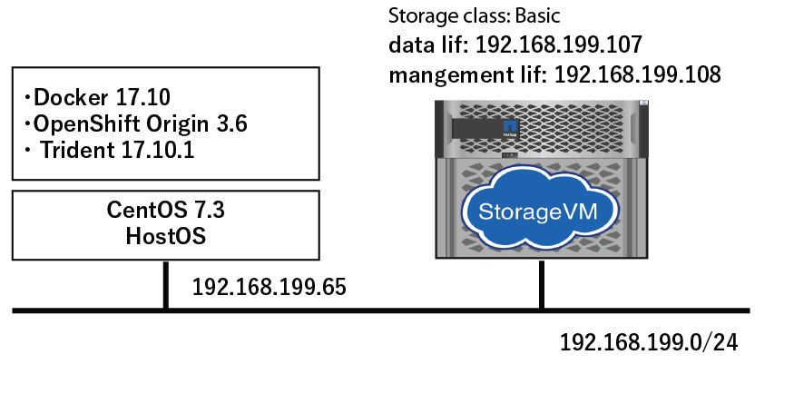

# Trident Getting Start

## 本ドキュメントの概要

本資料では NetApp trident storage orchestrator をインストールし、設定を行い実際にkubernetes/OpenShift からストレージをプロビジョニングするところまでを確認します。
trident のインストール、StorageClass の作成、 PersistenVolumeClaim の作成、PVの動的な作成を一連の流れで説明したものとなります。

そのため、ストレージの設定やOSの設定については簡易的なものとなっており、本番運用を検討する際には最適な設計が必要となります。

また、本ドキュメントでは Kubernetes/OpenShift のインストールや設定についてはすでにできているものとして trident に特化した内容となっています。

ドキュメント上 `oc` コマンドを使用していますが、`kubectl` でも実施可能です。


## 前提条件

- docker がインストール済みであること
- kubernetes または OpenShift を導入済みであること
- `kubectl` または `oc` コマンドが使用できること

## 動作確認した環境

- CentOS 7.3
- Docker 17.10
- OpenShift origin 3.6
- trident 17.10.1



## ホストOS設定

trident をデプロイするホストへ以下のパッケージをインストールし、サービスを有効化する。

```
$ sudo yum install -y nfs-utils jq
$ sudo yum install -y lsscsi iscsi-initiator-utils sg3_utils device-mapper-multipath 
$ sudo mpathconf --enable --with_multipathd y
$ sudo systemctl enable iscsid multipathd
$ sudo systemctl start iscsid multipathd
$ sudo systemctl enable iscsi
$ sudo systemctl start iscsi
```
    
## ストレージ設定

trident を起動する上で必要となるバックエンドストレージの設定を実施します。

今回は NFS のデータ永続化領域を準備します。
ONTAP に ssh でログイン後、CLI でコマンドを実行していきます。

以下の設定ではSVMを作成し、データアクセスのためのインターフェース作成、
SVM管理者が操作(ボリュームの作成・削除・変更）ができるアグリゲートも併せて設定します。
Broadast domain や ipspace については標準で準備されているものを使う想定です。
環境に応じて使用ください。

コマンドラインで指定するパラメータは以下の通りです。

|設定パラメータ |説明   |
|:---   |:---   |
| #{SVMNAME}    | 設定対象のSVMを指定   |
| #{IPSPACE}    | ipspace を指定、特に設定していないのであれば default |
| #{AGGR}       | SVM に関連付ける aggregate を指定      |
| #{DATA-LIF}   | NFS通信用のネットワークインターフェース |
| #{MGMT-LIF}   | SVM管理用のネットワークインターフェース |
| #{HOME-NODE} | LIFを作成するホームノード    |
| #{HOME-PORT} | LIFを作成するホームポート |
| #{IP}        | NFS通信をするLIFのIP |
| #{SVM-MGMT-IP} | 管理通信をするLIFのIP  |
| #{NETMASK}    | ネットマスク    |

```
$ vserver create -vserver #{SVMNAME}  -ipspace #{IPSPACE} -aggregate #{AGGR} -language C.UTF-8 -rootvolume root -rootvolume-security-style unix
$ nfs create -vserver #{SVMNAME} -access true -v3 enabled -v4.0 enabled -tcp enabled
$ export-policy rule create -vserver #{SVMNAME} -policyname default -clientmatch 0.0.0.0/0 -rorule any -rwrule any -superuser any
$ network interface create -vserver #{SVMNAME} -lif #{DATA-LIF} -role data -data-protocol nfs -home-node #{HOME-NODE} -home-port #{HOME-PORT} -address #{IP} -netmask #{NETMASK} -status-admin up -failover-policy system-defined -firewall-policy data -auto-revert true
$ network interface create -vserver #{SVMNAME} -lif #{MGMT-LIF} -role data -data-protocol none -home-node #{HOME-NODE} -home-port #{HOME-PORT} -address #{IP} -netmask #{NETMASK} -status-admin up -failover-policy system-defined -firewall-policy mgmt -auto-revert true
$ security login password -username vsadmin -vserver #{SVMNAME}
$ security login unlock -vserver #{SVMNAME} -username vsadmin
$ vserver modify -vserver #{SVMNAME} -aggr-list #{AGGR}
```

例: 以下の例では IP の割当は ONTAP の subnet 機能を使用して動的に割り当てています。

```
$ vserver create -vserver tridentsvm -ipspace watanabe_ipspace_199 -aggregate aggr3 -language C.UTF-8 -rootvolume root -rootvolume-security-style unix
$ nfs create -vserver tridentsvm -access true -v3 enabled -v4.0 enabled -tcp enabled
$ export-policy rule create -vserver tridentsvm -policyname default -clientmatch 0.0.0.0/0 -rorule any -rwrule any  -superuser any
$ network interface create -vserver tridentsvm -lif tridentlif -role data -data-protocol nfs -home-node SI-3270-02 -home-port e2b-199 -subnet-name watanabe_subnet -status-admin up -failover-policy system-defined -firewall-policy data -auto-revert true
$ network interface create -vserver tridentsvm -lif svm-mgmt -role data -data-protocol none -home-node SI-3270-02 -home-port e2b-199 -subnet-name watanabe_subnet -status-admin up -failover-policy system-defined -firewall-policy mgmt -auto-revert true
$ security login password -username vsadmin -vserver tridentsvm
$ security login unlock -vserver tridentsvm -username vsadmin
$ vserver modify -vserver tridentsvm -aggr-list aggr3
```

## 事前確認

kubectl または oc が入っていることを確認

```
[root@openshiftorigin openshift-poc]# kubectl version
Client Version: version.Info{Major:"1", Minor:"6", GitVersion:"v1.6.1+5115d708d7", GitCommit:"fff65cf", GitTreeState:"clean", BuildDate:"2017-10-25T18:58:10Z", GoVersion:"go1.7
.6", Compiler:"gc", Platform:"linux/amd64"}
Server Version: version.Info{Major:"1", Minor:"6", GitVersion:"v1.6.1+5115d708d7", GitCommit:"fff65cf", GitTreeState:"clean", BuildDate:"2017-10-25T18:58:10Z", GoVersion:"go1.7
.6", Compiler:"gc", Platform:"linux/amd64"}
[root@openshiftorigin openshift-poc]# oc version
oc v3.6.1+008f2d5
kubernetes v1.6.1+5115d708d7
features: Basic-Auth GSSAPI Kerberos SPNEGO

Server https://10.128.221.213:8443
openshift v3.6.1+008f2d5
kubernetes v1.6.1+5115d708d7
```


Pod から ストレージへ接続できることを確認

```
[root@openshiftorigin openshift-poc]# oc login -u system:admin
Logged into "https://10.128.221.213:8443" as "system:admin" using existing credentials.

You have access to the following projects and can switch between them with 'oc project <projectname>':

    default
    kube-public
    kube-system
    openshift
    openshift-infra
  * test

Using project "test".
[root@openshiftorigin openshift-poc]# kubectl auth can-i '*' '*' --all-namespaces
yes
[root@openshiftorigin openshift-poc]# kubectl run -i --tty ping --image=busybox --restart=Never --rm -- ping 192.168.199.108
If you don't see a command prompt, try pressing enter.
                                                      PING 192.168.199.108 (192.168.199.108): 56 data bytes
64 bytes from 192.168.199.108: seq=0 ttl=254 time=2.494 ms
64 bytes from 192.168.199.108: seq=1 ttl=254 time=0.267 ms
^C
--- 192.168.199.108 ping statistics ---
2 packets transmitted, 2 packets received, 0% packet loss
round-trip min/avg/max = 0.267/1.380/2.494 ms
```

## Docker image のダウンロード

trident デプロイ中にイメージがローカルになければダウンロードしますが、タイムアウトが発生し失敗することもあるため
事前にダウンロードします。

```
$ docker pull netapp/trident-launcher:17.10.1
$ docker pull netapp/trident:17.10.1
$ docker pull quay.io/coreos/etcd:3.1.3
```

## Trident インストーラのダウンロード

インストーラのダウンロードは以下のURLからダウンロードしたいバージョンを確認しダウンロードURLをメモしてください。

- [GitHub Release Pages](https://github.com/NetApp/trident/releases)


例えば、 17.10.1 であれば以下のURLとなります。

```
https://github.com/NetApp/trident/releases/download/v17.10.1/trident-installer-17.10.1.tar.gz
```

インストール後、解凍します。

```
$ wget https://github.com/NetApp/trident/releases/download/v17.10.1/trident-installer-17.10.1.tar.gz
$ tar xzf trident*.tar.gz && cd trident-installer
```

## tridentctl のインストール

tridentctl という trident を操作するコマンドラインユティリティです。

tridentctl をパスの通った場所へ配置します

```
$ mv tridentctl /usr/local/bin/ && chmod +x /usr/local/bin/tridentctl
```

tridentctl  のバージョンを確認します。

`command not found` のようなエラーが出た場合は配置した場所にパスが通っているか、
想定の場所にコピーできているかを確認してください。

```
$ tridentctl version
+----------------+----------------+
| SERVER VERSION | CLIENT VERSION |
+----------------+----------------+
| 17.10.1        | 17.10.1        |
+----------------+----------------+
```

## バックエンドの設定ファイルを作成

コンフィグファイルの作成を行います。

ここで指定する `dataLIF` に指定する ip や `svm` には存在しないものを指定すると以降で行うデプロイに失敗します。

```
cat << EOF > setup/backend.json
{
    "version": 1,
    "storageDriverName": "ontap-nas",
    "dataLIF": "192.168.199.107",
    "managementLIF": "192.168.199.108",
    "svm": "tridentsvm",
    "username": "admin",
    "password": "netapp123"
}
EOF
```

設定パラメータについては以下のURLを参照ください。

- [Backend configuration options](https://netapp-trident.readthedocs.io/en/latest/operations/tasks/backends/ontap.html#backend-configuration-options)

設定に必要なパラメータについて抜粋しました。

|パラメータ	| 説明	| デフォルト値 |
|:---       | :---          |:---    |
|version	| 常に 1	| |
|storageDriverName	| “ontap-nas”, “ontap-nas-economy”, “ontap-san” のいずれか| |
|managementLIF 	| クラスタ管理またはSVM管理のIPアドレス|“10.0.0.1”|
|dataLIF	|データ通信用のLIFのIP | |
|svm	|使用する SVM 名	| |
|username	|cluster または SVMへ接続するユーザ名 |
|password	|cluster または SVMへ接続するユーザ名のパスワード |
|storagePrefix	|ボリュームを作成する際にボリューム名に付与するもの |“trident”|



## 接続の確認

OpenShift クラスタに admin として接続できることを確認。

```
$ oc login -u system:admin
```

## アプリケーションをデプロイするネームスペースに trident をインストール

backend の json ファイルを setup ディレクトリで確認

```
[root@openshiftorigin trident-installer]# ls setup/
    backend.json 
```
    
namespace を作成し、trident をデプロイします。

```
[root@openshiftorigin trident-installer]# oc create namespace trident
namespace "trident" created
```

trident のインストーラーを起動します。

```
[root@openshiftorigin trident-installer]# ./install_trident.sh -n trident
Installer assumes you have deployed OpenShift.
clusterrolebinding "trident" deleted
clusterrolebinding "trident-launcher" deleted
clusterrole "trident" deleted
clusterrole "trident-launcher" deleted
serviceaccount "trident" created
serviceaccount "trident-launcher" created
clusterrole "trident" created
clusterrole "trident-launcher" created
clusterrolebinding "trident" created
clusterrolebinding "trident-launcher" created
configmap "trident-launcher-config" created
pod "trident-launcher" created
Trident deployment definition is available in /root/openshift-poc/trident/trident-installer/setup/trident-deployment.yaml.
Started launcher in namespace "trident".
```


trident の起動を確認します。
trident のポッドが起動するには数分時間がかかります。
`oc get pods` の結果が以下の容易なればデプロイ完了です。

```
[root@openshiftorigin trident-installer]# oc get pods
NAME                       READY     STATUS      RESTARTS   AGE
trident-3611124473-n010g   2/2       Running     1          6m
trident-launcher           0/1       Completed   0          6m
```

trident-xxxxx-xxxx というコンテナが起動していればデプロイ成功です。

### よく起きる事象

trident-ephemeral で止まる場合には backend.json が間違っているので IP や SVM が正しいことを確認

```
[root@openshiftorigin trident-installer]# oc get pods
NAME                READY     STATUS      RESTARTS   AGE
trident-ephemeral   1/1       Running     0          2m
trident-launcher    0/1       Completed   0          2m
```

## 動作確認

### trident へバックエンドストレージを追加

バックエンドの追加をします。

```
[root@openshiftorigin trident-installer]# tridentctl -n trident create backend -f setup/backend.json
+--------------------------+----------------+--------+---------+
|           NAME           | STORAGE DRIVER | ONLINE | VOLUMES |
+--------------------------+----------------+--------+---------+
| ontapnas_192.168.199.107 | ontap-nas      | true   |       0 |
+--------------------------+----------------+--------+---------+
```

ログの確認を行います, "Added a new backend" が表示され、その後エラーが発生していなければ完了です。

```
[root@openshiftorigin trident-installer]# tridentctl -n trident logs
trident log:
... 割愛
time="2017-11-28T07:46:32Z" level=info msg="Added a new backend." backend="ontapnas_192.168.199.107" handler=AddBackend
time="2017-11-28T07:46:32Z" level=info msg="API server REST call." duration=234.586055ms method=POST route=AddBackend uri="/trident/v1/backend"
time="2017-11-28T07:46:32Z" level=debug msg="Sanitizing common config." name=ontap-nas
time="2017-11-28T07:46:32Z" level=debug msg="Sanitizing common config." name=ontap-nas
time="2017-11-28T07:46:32Z" level=info msg="API server REST call." duration=209.772µs method=GET route=GetBackend uri="/trident/v1/backend/ontapnas_192.168.199.107"
```

追加した内容を確認します。
    
```
[root@openshiftorigin trident-installer]# tridentctl get backend -o json -n trident
{
  "items": [
    {
      "name": "ontapnas_192.168.199.107",
      "config": {
        "version": 1,
        "storageDriverName": "ontap-nas",
        "storagePrefix": "trident",
        "serialNumbers": []
      },
      "storage": {
        "aggr3": {
          "name": "aggr3",
          "storageAttributes": {
            "backendType": {
              "offer": [
                "ontap-nas"
              ]
            },
            "encryption": {
              "offer": true
            },
            "media": {
              "offer": [
                "hdd"
              ]
            },
            "provisioningType": {
              "offer": [
                "thick",
                "thin"
              ]
            },
            "snapshots": {
              "offer": true
            }
          },
          "storageClasses": [],
          "volumes": []
        }
      },
      "online": true,
      "volumes": []
    }
  ]
}
```
    
### StorageClass の定義

StorageClass の定義ファイルを作成します。

今回は trident-installer に入っているサンプルを使用し、Storage Class を作成します。

```
[root@openshiftorigin trident-installer]# cat sample-input/storage-class-ontap-gold.yaml
apiVersion: storage.k8s.io/v1beta1
kind: StorageClass
metadata:
  name: ontap-gold
provisioner: netapp.io/trident
parameters:
  backendType: "ontap-nas"
  media: "ssd"
  provisioningType: "thin"
  snapshots: "true"
```
    

２つ目の確認を行います。

```
[root@openshiftorigin trident-installer]# cat sample-input/storage-class-basic.yaml
apiVersion: storage.k8s.io/v1beta1
kind: StorageClass
metadata:
  name: basic
provisioner: netapp.io/trident
parameters:
  backendType: "ontap-nas"
```

** apiVersion: storage.k8s.io/v1 がすでに使用可能ですが今回は、サンプルに包含されているものをそのまま使います。

ストレージクラスを作成します。

```
[root@openshiftorigin trident-installer]# oc create -f sample-input/storage-class-basic.yaml
storageclass "basic" created

[root@openshiftorigin trident-installer]# oc create -f sample-input/storage-class-ontap-gold.yaml
storageclass "ontap-gold" created
```
    
作成後の確認

```
[root@openshiftorigin trident-installer]# oc get sc
NAME         TYPE
basic        netapp.io/trident
ontap-gold   netapp.io/trident
[root@openshiftorigin trident-installer]#
[root@openshiftorigin trident-installer]# tridentctl -n trident get storageclass basic -o json
{
  "items": [
    {
      "Config": {
        "version": "1",
        "name": "basic",
        "attributes": {
          "backendType": "ontap-nas"
        }
      },
      "storage": {
        "ontapnas_192.168.199.107": [
          "aggr3"
        ]
      }
    }
  ]
}
[root@openshiftorigin trident-installer]# tridentctl -n trident get storageclass ontap-gold -o json
{
  "items": [
    {
      "Config": {
        "version": "1",
        "name": "ontap-gold",
        "attributes": {
          "backendType": "ontap-nas"
        }
      },
      "storage": {}
    }
  ]
}
[root@openshiftorigin trident-installer]# tridentctl get backend -o json | jq '[.items[] | {backend: .name, storageClass
es: [.storage[].storageClasses]|unique}]'
[
  {
    "backend": "ontapnas_192.168.199.107",
    "storageClasses": [
      [
        "basic"
      ]
    ]
  }
]
```

    
### PVC の作成
    
StorageClassと同様にtrident-installer に入っているサンプルでPVCを作成します。

```
[root@openshiftorigin trident-installer]# oc create -f sample-input/pvc-basic.yaml
persistentvolumeclaim "basic" created
```

```
[root@openshiftorigin trident-installer]# oc get pvc -aw
NAME      STATUS    VOLUME                CAPACITY   ACCESSMODES   STORAGECLASS   AGE
basic     Bound     trident-basic-f4048   1Gi        RWO           basic          1m
trident   Bound     trident   2Gi       RWO                 5d
```


### サンプルアプリケーションのデプロイ

ここではサンプルとしてウェブサーバをデプロイし、動的にストレージをプロビジョニングします。

```
[root@openshiftorigin trident-installer]# cd ../demo
[root@openshiftorigin demo]# cat << EOF > task-pv-pod.yaml
> kind: Pod
> apiVersion: v1
> metadata:
>   name: task-pv-pod
> spec:
>   volumes:
>     - name: task-pv-storage
>       persistentVolumeClaim:
>        claimName: basic
>   containers:
>     - name: task-pv-container
>       image: nginx
>       ports:
>         - containerPort: 80
>           name: "http-server"
>       volumeMounts:
>         - mountPath: "/usr/share/nginx/html"
>           name: task-pv-storage
> EOF
[root@openshiftorigin demo]# oc create -f task-pv-pod.yaml
pod "task-pv-pod" created
[root@openshiftorigin demo]#
```


Pod がデプロイされたことを確認。

```
[root@openshiftorigin demo]# kubectl get pod -aw
NAME          READY     STATUS    RESTARTS   AGE
task-pv-pod   1/1       Running   0          3h
trident-3611124473-n010g   2/2       Running   1         5d
trident-launcher   0/1       Completed   0         5d
```

Pod からストレージがマウントされていることを確認します。

```
[root@openshiftorigin demo]# kubectl exec -it task-pv-pod -- df -h /usr/share/nginx/html
Filesystem                                    Size  Used Avail Use% Mounted on
192.168.199.107:/trident_trident_basic_f4048  973M  192K  973M   1% /usr/share/nginx/html
```

### 必要であれば削除処理実施

Pod を削除します。

```
[root@openshiftorigin trident]# kubectl delete pod task-pv-pod
pod "task-pv-pod" deleted
[root@openshiftorigin trident]# kubectl get pod -aw
NAME                       READY     STATUS    RESTARTS   AGE
trident-3611124473-n010g   2/2       Running   1          5d
trident-launcher   0/1       Completed   0         5d
```

PVC を削除します。

```
kubectl delete pvc basic
```

trident のアンインストールはインストーラディレクトリに存在する uninstall_trident.sh を実行することで削除します。

```
./uninstall_trident.sh -n trident
```

上記の削除処理をしてもストレージに永続化されたデータは残った状態となります。

### Technical resources

本ドキュメントを作成する上で参考にした情報源は以下の通りです。

- [Trident 公式マニュアル](https://netapp-trident.readthedocs.io/en/latest/index.html)
- [Trident GitHub](https://github.com/NetApp/trident)

